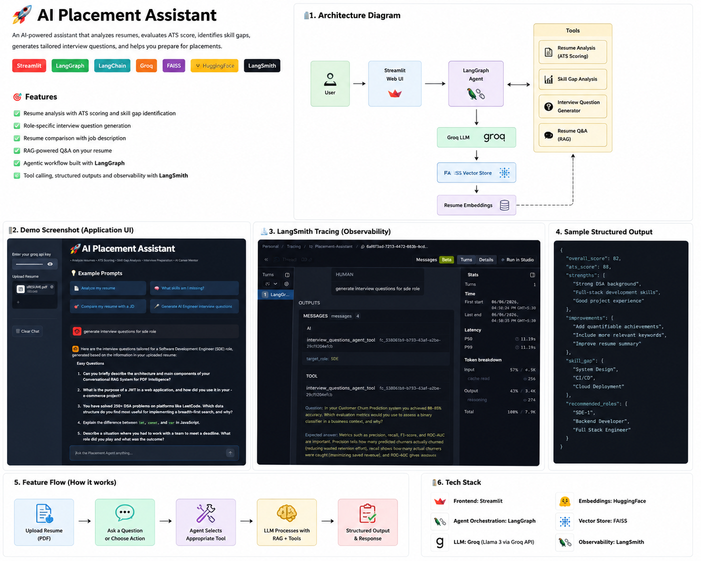
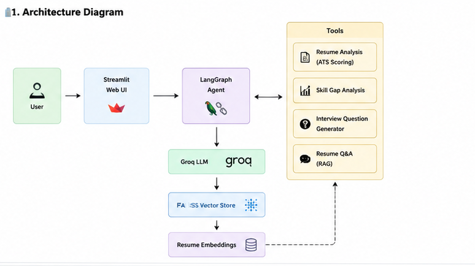
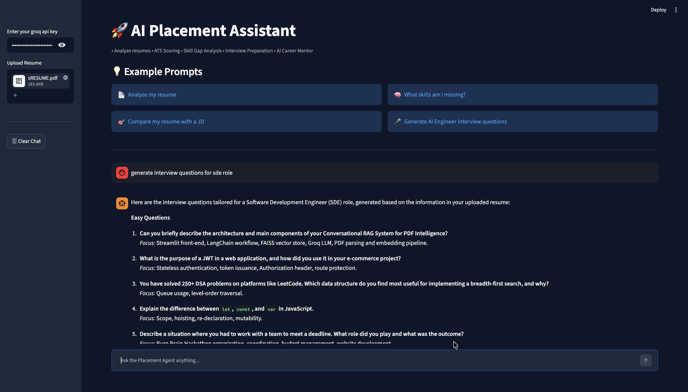
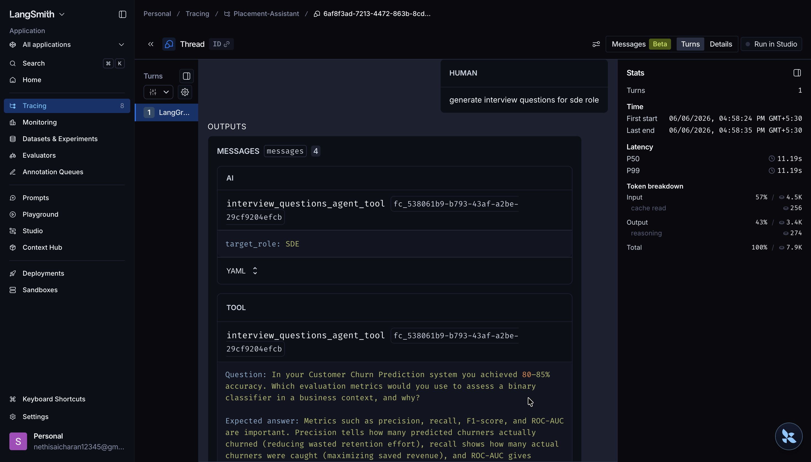

# AI Placement Assistant

<p align="center">
  
</p>

<p align="center">
  
  
  
  
  
  
</p>

An Agentic AI-powered Placement Preparation Platform that helps students analyze resumes, evaluate ATS readiness, prepare for interviews, and interact with their resumes through conversational AI.

Built using **LangChain**, **LangGraph**, **Groq LLMs**, **FAISS**, **Streamlit**, and **LangSmith**.

---

## 🌟 Features

### 📄 Resume Analysis

* Upload a resume in PDF format.
* Get detailed strengths, weaknesses, and improvement suggestions.
* Receive structured feedback for resume optimization.

### 🎯 ATS Score Checker

* Compare resumes against Job Descriptions.
* Generate:

  * ATS Score
  * Matching Keywords
  * Missing Keywords
  * Improvement Suggestions
* Powered by Pydantic structured outputs.

### 📈 Skill Gap Analysis

- Identifies missing skills by comparing the resume against a target role or job description.
- Highlights:
  - Missing Technical Skills
  - Missing Tools & Frameworks
  - Missing Domain Knowledge
  - Priority Areas for Improvement
- Generates actionable recommendations to improve employability.
- Uses structured outputs powered by Pydantic.

### 🎤 Interview Question Generator

* Generates personalized interview questions based on:

  * Resume content
  * Target role
* Covers:

  * Technical Questions
  * Project-Based Questions
  * CS Fundamentals
  * Behavioral Questions
* Categorized by difficulty level.

### 💬 Resume Q&A (RAG)

* Ask questions directly about your resume.
* Uses Retrieval-Augmented Generation (RAG).
* Retrieves relevant resume chunks using FAISS before generating answers.

### 🤖 Agent Mode

The LangGraph Agent automatically selects the correct tool based on user intent.

Available tools:

* Resume Analysis Tool
* ATS Checker Tool
* Skill Gap Analysis Tool
* Interview Question Generator Tool
* Resume Q&A Tool

### 🧠 Conversational Memory

* Multi-turn conversations supported.
* Chat history maintained across interactions.
* LangGraph checkpointing used for memory management.


---

## 📸 Application Demo
### Project Architecture
<p align="center">
  
</p>

---
### AI Placement Assistant Interface

<p align="center">
  
</p>

The assistant automatically routes user requests to the appropriate tool and generates structured, role-specific outputs.

---

## 📊 LangSmith Tracing & Monitoring

<p align="center">
  
</p>

LangSmith integration provides:

* Agent execution tracing
* Tool call inspection
* Token usage monitoring
* Latency analysis
* Debugging and evaluation support

---

## 🏗️ Architecture
```
                           Resume PDF
                                │
                                ▼
                         PDF Processing
                                │
                                ▼
                        Document Chunking
                                │
                                ▼
                    HuggingFace Embeddings
                                │
                                ▼
                         FAISS Vector DB
                                │
                                ▼
                        Retrieval Layer
                                │
                                ▼
                       LangGraph Agent
                                │
   ┌─────────────┬─────────────┬─────────────┬─────────────┐
   ▼             ▼             ▼             ▼             ▼
Resume      ATS Score     Skill Gap     Interview     Resume Q&A
Analysis     Checker      Analysis      Generator       (RAG)
                                │
                                ▼
                       Groq GPT-OSS-120B
                                │
                                ▼
                          Streamlit UI
```
---

## 📌 Resume Impact

* Built an Agentic AI Placement Assistant using LangGraph and LangChain.
* Implemented 5 specialized AI tools for Resume Analysis, ATS Evaluation, Skill Gap Analysis Interview Preparation, and Resume Q&A.
* Developed a Retrieval-Augmented Generation (RAG) pipeline using FAISS and HuggingFace Embeddings.
* Integrated structured outputs using Pydantic schemas for reliable responses.
* Added conversational memory using LangGraph checkpointing.
* Enabled observability and debugging with LangSmith tracing.

---

## 🛠️ Tech Stack

| Category        | Technologies          |
| --------------- | --------------------- |
| LLM             | GPT-OSS-120B via Groq |
| Agent Framework | LangChain, LangGraph  |
| Vector Database | FAISS                 |
| Embeddings      | HuggingFace           |
| Frontend        | Streamlit             |
| Validation      | Pydantic              |
| Observability   | LangSmith             |
| Language        | Python                |

---

## 📂 Project Structure

```text
AI-Placement-Assistant/
│
├── app.py
├── agent.py
│
├── tools/
│   ├── resume_analysis.py
│   ├── ats_checker.py
│   ├── interview_qns.py
│   ├── resume_qa.py
│   └── agent_tools.py
│
├── schemas/
│   ├── ats_schema.py
│   └── interview_schema.py
│
├── utils/
│   ├── pdf_loader.py
│   └── vectorstore.py
│
├── assets/
│   ├── project-overview.png
│   ├── ui-demo.png
│   └── langsmith-trace.png
│
├── .env
├── requirements.txt
└── README.md
```

---

## ⚙️ Installation

### 1. Clone Repository

```bash
git clone https://github.com/charrann12/AI-Placement-Assistant.git
cd AI-Placement-Assistant
```

### 2. Create Virtual Environment

```bash
python -m venv venv
```

#### Windows

```bash
venv\Scripts\activate
```

#### macOS/Linux

```bash
source venv/bin/activate
```

### 3. Install Dependencies

```bash
pip install -r requirements.txt
```

### 4. Configure Environment Variables

Create a `.env` file:

```env
LANGCHAIN_API_KEY=YOUR_LANGSMITH_API_KEY
LANGCHAIN_TRACING_V2=true
LANGCHAIN_PROJECT=Placement-Assistant
```

Groq API Key can be entered directly from the Streamlit sidebar.

---

## ▶️ Run Application

```bash
streamlit run app.py
```

---

## 🔄 Workflow

1. Upload Resume
2. PDF Parsing & Chunking
3. Vector Store Creation
4. User Query Sent to Agent
5. Agent Selects Appropriate Tool
6. Tool Executes
7. Groq LLM Generates Response
8. Structured Output Displayed

---

## 🔥 Key Concepts Demonstrated

* Retrieval-Augmented Generation (RAG)
* Agentic AI Workflows
* Tool Calling
* Conversational Memory
* Structured Outputs
* Vector Databases
* Prompt Engineering
* LangGraph State Management
* LangSmith Tracing
* LLM Application Development
* Skill Gap Detection
* Resume-to-JD Semantic Comparison

---

## 🎯 Future Improvements

* Learning Roadmap Generator
* Persistent Memory Storage
* Resume Version Comparison
* PDF Report Export
* Mock Interview Simulation
* Multi-Agent Architecture

---

## 👨‍💻 Author

**Sai Charan Nethi**

B.Tech Computer Science & Engineering
National Institute of Technology Durgapur

GitHub: https://github.com/charrann12

---

## ⭐ Support

If you found this project useful, consider giving it a ⭐ on GitHub.
